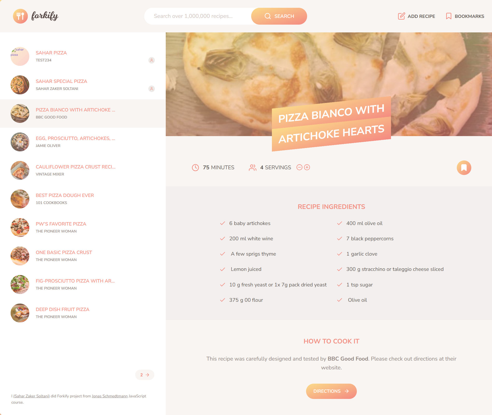

# Forkify – Recipe Search App

Built as part of Jonas Schmedtmann’s _Complete JavaScript Course_ on Udemy, Forkify is a modern recipe search and bookmarking app. You can search, view, bookmark, and scale recipes seamlessly.

[Live Demo](https://forkify-zakersoltani.netlify.app/)

---

## Screenshot



---

## Features

- **Search Recipes** by keywords or ingredients.
- **View Recipe Details** such as ingredients, instructions, and serving size.
- **Adjust Servings**, with dynamic ingredient quantities.
- **Bookmark Favorites** for quick future access.
- **Add Recipes** add new recipes.

---

## Built With

- **JavaScript (ES6+)**
- **HTML5 & CSS3 / SCSS**
- **Parcel** (bundler)
- **NPM** for dependency management
- **Forkify API** for fetching recipe data
- **MVC Architecture**, **Async/Await**, and **LocalStorage**

---

## Getting Started

### 1️⃣ Prerequisites

Make sure you have the following installed on your machine:

- [Node.js](https://nodejs.org/)
- [npm](https://www.npmjs.com/)

### 2️⃣ Clone the Repository

```bash
git clone https://github.com/saharzakersoltani/forkify.git
```

### 3️⃣ Navigate into the Project Folder

```bash
cd forkify
```

### 4️⃣ Install Dependencies

```bash
npm install
```

### 5️⃣ Start the Development Server

```bash
npm start
```

---

## Contact

If you have any questions, feedback, or just want to connect, feel free to reach out:

- **GitHub:** [@saharzakersoltani](https://github.com/saharzakersoltani)
- **Email:** sahar.zs2002@gmail.com
- **LinkedIn:** [Sahar Zaker Soltani](https://www.linkedin.com/in/sahar-zaker-soltani)
